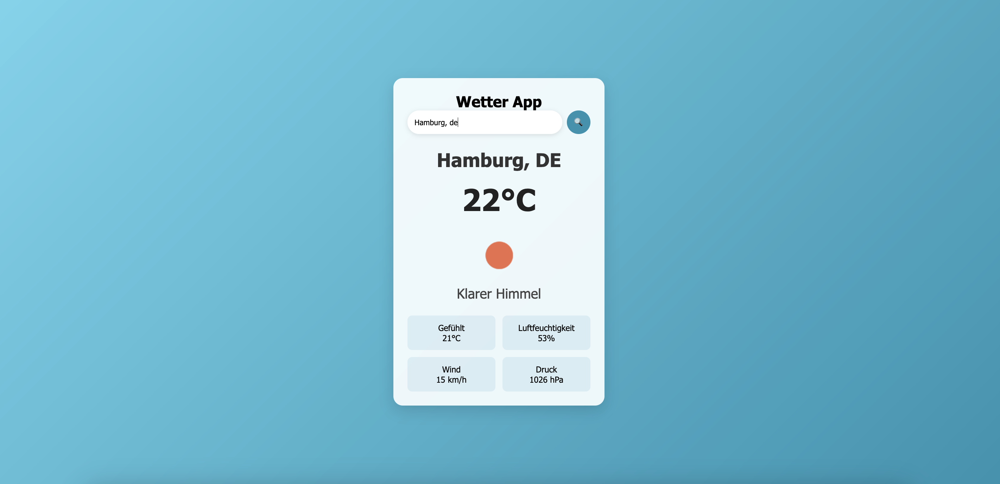

# WirdsRegnen 🌦️

     
## Beschreibung
 
Eine schlanke, responsive Web-App, die aktuelle Wetterdaten für beliebige Städte anzeigt. Nutzt die OpenWeatherMap-API, um Temperatur, Luftfeuchtigkeit, Wind und mehr in Echtzeit abzurufen.

## Verwendete Technologie

- JavaScript
- HTML, CSS
- OpenWeatherAPI

